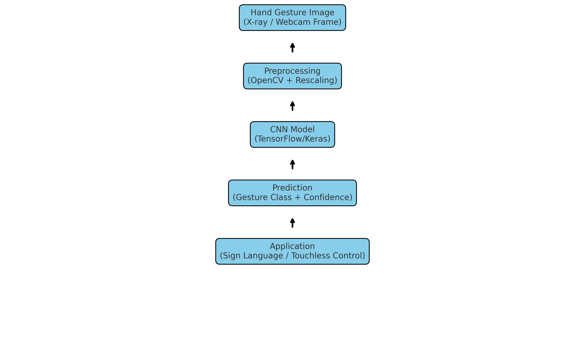
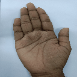

# Gesture-Recognition

🤖 Hand Gesture Recognition using Deep Learning

📌 Overview

This project implements a Convolutional Neural Network (CNN) for hand gesture recognition. The system classifies gestures such as HELLO, PEACE, THUMBS UP, and YO, enabling applications like sign language translation, touchless controls, and HCI (Human–Computer Interaction).

Built with TensorFlow/Keras and OpenCV, the model achieves high accuracy (~85%) and can run both on pre-collected datasets and real-time webcam input.

🚀 Features

🖼️ Image Preprocessing with OpenCV & Keras ImageDataGenerator

🧠 CNN Model built with Conv2D, MaxPooling, Dropout, Dense layers

📊 Model Evaluation using Accuracy, Loss curves, Confusion Matrix & Precision-Recall curves

🎥 Real-Time Webcam Predictions (via Colab/Jupyter integration)

💾 Model Saving & Loading (model.h5)

📂 Dataset

Dataset contains hand gesture images organized by classes.

Example gestures:

HELLO ✋

PEACE ✌️

THUMBS UP 👍

YO 🤟

## 📊 Workflow

## 🎥 Demo

